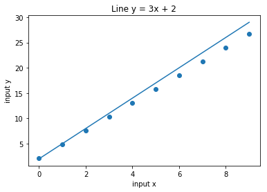
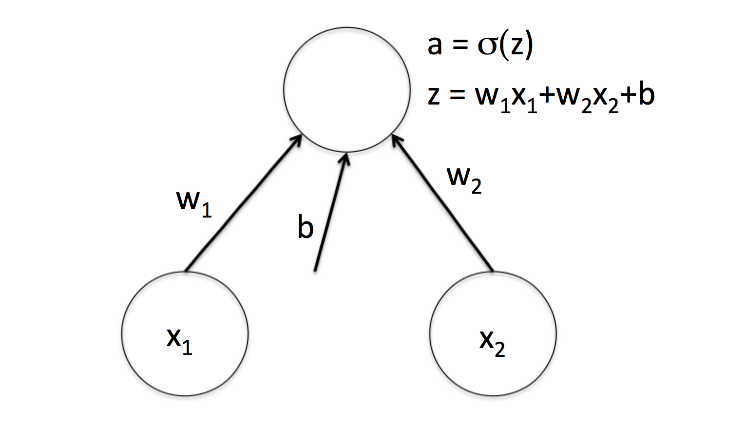
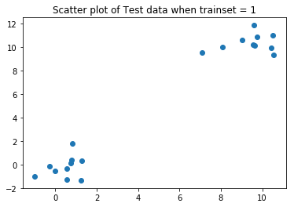
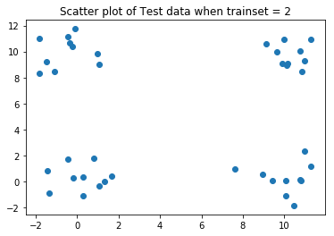
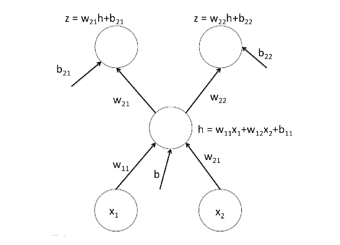

# Training data with Neural networks with simple Architecture


```python
#import all the libraries
import numpy as np
import sys
import matplotlib.pyplot as plt
import pandas as pd
from sklearn.preprocessing import normalize
from mpl_toolkits.mplot3d import Axes3D
```

### Part 1: Training of a neural network with a simple architecture


```python
###generates n random training inputs on the line y=3x+2
def simplest_training_data(n):
  w = 3
  b = 2
  x = np.random.uniform(0,1,n)
  y = 3*x+b+0.3*np.random.normal(0,1,n)
  return (x,y)

#this is the training function
#parameters:
# n - size of training data
# k - total number of iterations to use during training.
# eta - is the learning rate 
def simplest_training(n, k, eta):
  #get the data
  X, Y = simplest_training_data(n)
  weight = np.random.normal(0,1,1)
  bias = 0

  #iterate over all the inputs k times
  for i in range(0,k):
      delta_w = 0
      delta_b = 0

      #train every input
      for x, y in zip(X, Y):
           a = weight*x  + bias
           delta_w = delta_w + (2 * (a - y) * x)
           delta_b = delta_b + (2 * (a - y))

      #adjust the weight and bias after training
      weight = weight - (eta * delta_w/n)
      bias = bias - (eta * delta_b/n)

  theta = (weight, bias)
  return theta

##testing function
"""
parameters:
theta - represent newtork parameters
x - is the training data"""
def simplest_testing(theta, x):
  x = np.array(x)
  y = (theta[0] * x) + theta[1]
  return y
```

We run the algorithm with n = 30, k = 10, 000, η = .02. Test the output using inputs from 0 to 9. You should get output close to:
1.9504, 4.9666, 7.9828, 10.9990, 14.0152, 17.0314, 20.0476, 23.0638, 26.0800, 29.0962

These points fit the line y = 3x + 2.

I will now test my algorithm with a graph that should give output that are close to the line y = 3x + 2


```python
x = np.array([i for i in range(0,10)])
y = simplest_testing(simplest_training(30, 10000,0.02),x )
print(x)
plt.scatter(x,y)
plt.xlabel("input x")
plt.ylabel("input y")
plt.title("Line y = 3x + 2")
plt.plot(x, 3*x + 2)
plt.show()
```

    [0 1 2 3 4 5 6 7 8 9]





Our training algorithm generates the correct y values because it generates points close to the line y=3x + 2 

## Part 2: Training a neural network with just an input and output layer architecture with no hidden layers



We will be using cross-entropy loss


```python
### Provided function to create training data
"""function returns X and y. This provides two different training sets. When the input, trainset, is 1, the
function produces a simple, linearly separable training set. Half the points are near (0, 0) and half are
near (10, 10). X is a matrix in which each row contains one of these points, so it is n × 2, where n is
the number of points. y is a vector of class labels, which have the value 1 for the points near (0, 0)
and 0 for the points near (1, 1).
When trainset is 2, we generate a different training set that is not linearly separable, but that
corresponds to the Xor problem. Points from class 1 are either near (0, 0) or (10, 10), while points in
class 0 are near either (10, 0) or (0, 10)."""
def single_layer_training_data(trainset):
  n = 10
  if trainset == 1:
    # Linearly separable
    X = np.concatenate((np.random.normal((0,0),1,(n,2)), np.random.normal((10,10),1,(n,2))),axis=0)
    y = np.concatenate((np.ones(n), np.zeros(n)),axis=0)

  elif trainset == 2:
    # Not Linearly Separable
    X = np.concatenate((np.random.normal((0,0),1,(n,2)), np.random.normal((10,10),1,(n,2)), np.random.normal((10,0),1,(n,2)), np.random.normal((0,10),1,(n,2))),axis=0)
    y = np.concatenate((np.ones(2*n), np.zeros(2*n)), axis=0)

  else:
    #print ("function single_layer_training_data undefined for input", trainset
    sys.exit()

  return (X,y)

#training function
"""
parameter:
    k - number of iterations
    eta - learning rate
    trainset - is the training data
returns network parameters"""
def single_layer_training(k, eta, trainset):
  X, Y = single_layer_training_data(trainset)
  n = len(Y)


  #iterate over all the inputs k times
  for i in range(0,k):
      weight = [np.random.normal(0,1,2)]
      bias = 0

      #delta variables represent the total loss of all points.
      delta_w = [0,0]
      delta_b = 0
    
      #train every input      
      for x, y in zip(X, Y):  
          z = np.dot(weight,x) 
          a = sigmoid(z)
          delta_w = delta_w + ((a - y) * x)
          delta_b = delta_b + (a - y)
     

      #adjust the weight and bias after training
      weight = weight - (eta/n * delta_w)
      bias = bias - (eta/n * delta_b)

  theta = (weight, bias)

  return theta

"""
paramaters:
    theta - network parameters
    X - test data
return predicted class
"""
def single_layer_testing(theta, X):
  X = np.array(X)
  y = sigmoid(np.dot(X, np.transpose(theta[0])) + theta[1])
  return y

def sigmoid(z):
    return 1.0/(1.0 * np.exp(-z))

def sigmoid_prime(z):
    return sigmoid(z)(1- sigmoid(z))
```

#### Training the data when trainset = 1


```python
#get the test data from trainset=1 and plot it
test_data1 = np.concatenate((np.random.normal((0,0),1,(10,2)), np.random.normal((10,10),1,(10,2))),axis=0)
plt.scatter(test_data1[:,0],test_data1[:,1] )
plt.title('Scatter plot of Test data when trainset = 1')
plt.show()
```





From the plot we can see the data is linearnly separable.
Our model should be able to linearly separate the data.


```python
theta = single_layer_training(10000,0.0001,1)
results = single_layer_testing(theta, test_data1)* 100
df = pd.DataFrame()
df['x1'] = test_data1[:,0]
df['x2'] = test_data1[:,1]
df['y'] = results
df
```


<div>
<style>
    .dataframe thead tr:only-child th {
        text-align: right;
    }

    .dataframe thead th {
        text-align: left;
    }

    .dataframe tbody tr th {
        vertical-align: top;
    }
</style>
<table border="1" class="dataframe">
  <thead>
    <tr style="text-align: right;">
      <th></th>
      <th>x1</th>
      <th>x2</th>
      <th>y</th>
    </tr>
  </thead>
  <tbody>
    <tr>
      <th>0</th>
      <td>-0.284699</td>
      <td>-0.124150</td>
      <td>119.001705</td>
    </tr>
    <tr>
      <th>1</th>
      <td>0.551404</td>
      <td>-1.280359</td>
      <td>382.994656</td>
    </tr>
    <tr>
      <th>2</th>
      <td>1.225079</td>
      <td>-1.325972</td>
      <td>369.122236</td>
    </tr>
    <tr>
      <th>3</th>
      <td>0.774528</td>
      <td>0.373221</td>
      <td>59.888545</td>
    </tr>
    <tr>
      <th>4</th>
      <td>0.745895</td>
      <td>0.135591</td>
      <td>78.154897</td>
    </tr>
    <tr>
      <th>5</th>
      <td>1.259708</td>
      <td>0.314441</td>
      <td>60.012808</td>
    </tr>
    <tr>
      <th>6</th>
      <td>-0.021047</td>
      <td>-0.577876</td>
      <td>189.841190</td>
    </tr>
    <tr>
      <th>7</th>
      <td>0.805790</td>
      <td>1.755860</td>
      <td>12.950076</td>
    </tr>
    <tr>
      <th>8</th>
      <td>-0.988928</td>
      <td>-1.029797</td>
      <td>354.532504</td>
    </tr>
    <tr>
      <th>9</th>
      <td>0.541618</td>
      <td>-0.326061</td>
      <td>133.636453</td>
    </tr>
    <tr>
      <th>10</th>
      <td>10.434052</td>
      <td>9.913372</td>
      <td>0.000454</td>
    </tr>
    <tr>
      <th>11</th>
      <td>10.559590</td>
      <td>9.342511</td>
      <td>0.000839</td>
    </tr>
    <tr>
      <th>12</th>
      <td>9.742887</td>
      <td>10.843264</td>
      <td>0.000178</td>
    </tr>
    <tr>
      <th>13</th>
      <td>8.069029</td>
      <td>9.956658</td>
      <td>0.000588</td>
    </tr>
    <tr>
      <th>14</th>
      <td>9.626310</td>
      <td>10.118795</td>
      <td>0.000402</td>
    </tr>
    <tr>
      <th>15</th>
      <td>9.592680</td>
      <td>11.817659</td>
      <td>0.000062</td>
    </tr>
    <tr>
      <th>16</th>
      <td>7.108227</td>
      <td>9.521591</td>
      <td>0.001077</td>
    </tr>
    <tr>
      <th>17</th>
      <td>9.547324</td>
      <td>10.165017</td>
      <td>0.000386</td>
    </tr>
    <tr>
      <th>18</th>
      <td>9.020921</td>
      <td>10.576532</td>
      <td>0.000262</td>
    </tr>
    <tr>
      <th>19</th>
      <td>10.519246</td>
      <td>10.981477</td>
      <td>0.000138</td>
    </tr>
  </tbody>
</table>
</div>


As you can see from the data points from index 0 to 9 are centered around (0,0) and have significantly higher y values compared to points from index 10 to 19, which are centered around (10,10). This is because points from index 0 to 9 have a higher probability of being labeled 1 and points from index 10 to 19 have a high probability of being labeled 0

### training the data when trainset = 2


```python
#get the test data and plot it
test_data2 = np.concatenate((np.random.normal((0,0),1,(10,2)), np.random.normal((10,10),1,(10,2)), np.random.normal((10,0),1,(10,2)), np.random.normal((0,10),1,(10,2))),axis=0)
plt.scatter(test_data2[:,0],test_data2[:,1] )
plt.title('Scatter plot of Test data when trainset = 2')
plt.show()
```





When trainset = 2 the data is not linearly separable.

However let us try to train our model over this data and observe the results


```python
#training model
results = single_layer_testing(single_layer_training(10000,0.1,1), test_data2) 
df = pd.DataFrame()
df['x1'] = test_data2[:,0]
df['x2'] = test_data2[:,1]
df['y'] = results * 100
df
```

    /home/joseph/anaconda3/lib/python3.6/site-packages/ipykernel_launcher.py:77: RuntimeWarning: overflow encountered in exp
    /home/joseph/anaconda3/lib/python3.6/site-packages/ipykernel_launcher.py:77: RuntimeWarning: divide by zero encountered in true_divide


<div>
<style>
    .dataframe thead tr:only-child th {
        text-align: right;
    }

    .dataframe thead th {
        text-align: left;
    }

    .dataframe tbody tr th {
        vertical-align: top;
    }
</style>
<table border="1" class="dataframe">
  <thead>
    <tr style="text-align: right;">
      <th></th>
      <th>x1</th>
      <th>x2</th>
      <th>y</th>
    </tr>
  </thead>
  <tbody>
    <tr>
      <th>0</th>
      <td>0.300794</td>
      <td>0.349411</td>
      <td>0.000000</td>
    </tr>
    <tr>
      <th>1</th>
      <td>0.803431</td>
      <td>1.759227</td>
      <td>0.000000</td>
    </tr>
    <tr>
      <th>2</th>
      <td>1.043094</td>
      <td>-0.379508</td>
      <td>0.000000</td>
    </tr>
    <tr>
      <th>3</th>
      <td>-0.197635</td>
      <td>0.282748</td>
      <td>0.000000</td>
    </tr>
    <tr>
      <th>4</th>
      <td>-0.459661</td>
      <td>1.725869</td>
      <td>0.000000</td>
    </tr>
    <tr>
      <th>5</th>
      <td>-1.334470</td>
      <td>-0.941041</td>
      <td>inf</td>
    </tr>
    <tr>
      <th>6</th>
      <td>1.340669</td>
      <td>-0.042448</td>
      <td>0.000000</td>
    </tr>
    <tr>
      <th>7</th>
      <td>0.267657</td>
      <td>-1.105681</td>
      <td>inf</td>
    </tr>
    <tr>
      <th>8</th>
      <td>-1.456520</td>
      <td>0.818668</td>
      <td>inf</td>
    </tr>
    <tr>
      <th>9</th>
      <td>1.660923</td>
      <td>0.421222</td>
      <td>0.000000</td>
    </tr>
    <tr>
      <th>10</th>
      <td>10.151573</td>
      <td>9.114670</td>
      <td>0.000000</td>
    </tr>
    <tr>
      <th>11</th>
      <td>9.628180</td>
      <td>9.996233</td>
      <td>0.000000</td>
    </tr>
    <tr>
      <th>12</th>
      <td>10.780787</td>
      <td>10.035556</td>
      <td>0.000000</td>
    </tr>
    <tr>
      <th>13</th>
      <td>10.962549</td>
      <td>9.291714</td>
      <td>0.000000</td>
    </tr>
    <tr>
      <th>14</th>
      <td>9.986393</td>
      <td>10.936620</td>
      <td>0.000000</td>
    </tr>
    <tr>
      <th>15</th>
      <td>11.280584</td>
      <td>10.908937</td>
      <td>0.000000</td>
    </tr>
    <tr>
      <th>16</th>
      <td>9.897760</td>
      <td>9.068724</td>
      <td>0.000000</td>
    </tr>
    <tr>
      <th>17</th>
      <td>10.857004</td>
      <td>8.484367</td>
      <td>0.000000</td>
    </tr>
    <tr>
      <th>18</th>
      <td>9.140709</td>
      <td>10.566351</td>
      <td>0.000000</td>
    </tr>
    <tr>
      <th>19</th>
      <td>10.094639</td>
      <td>8.923586</td>
      <td>0.000000</td>
    </tr>
    <tr>
      <th>20</th>
      <td>10.456333</td>
      <td>-1.860294</td>
      <td>0.000000</td>
    </tr>
    <tr>
      <th>21</th>
      <td>10.073919</td>
      <td>0.040274</td>
      <td>0.000000</td>
    </tr>
    <tr>
      <th>22</th>
      <td>9.411076</td>
      <td>0.039371</td>
      <td>0.000000</td>
    </tr>
    <tr>
      <th>23</th>
      <td>10.820891</td>
      <td>0.060374</td>
      <td>0.000000</td>
    </tr>
    <tr>
      <th>24</th>
      <td>8.960274</td>
      <td>0.505091</td>
      <td>0.000000</td>
    </tr>
    <tr>
      <th>25</th>
      <td>10.774815</td>
      <td>0.153069</td>
      <td>0.000000</td>
    </tr>
    <tr>
      <th>26</th>
      <td>7.634186</td>
      <td>0.923592</td>
      <td>0.000000</td>
    </tr>
    <tr>
      <th>27</th>
      <td>11.292694</td>
      <td>1.158945</td>
      <td>0.000000</td>
    </tr>
    <tr>
      <th>28</th>
      <td>10.963924</td>
      <td>2.329469</td>
      <td>0.000000</td>
    </tr>
    <tr>
      <th>29</th>
      <td>10.074013</td>
      <td>-1.128407</td>
      <td>0.000000</td>
    </tr>
    <tr>
      <th>30</th>
      <td>-1.807758</td>
      <td>8.312151</td>
      <td>0.000000</td>
    </tr>
    <tr>
      <th>31</th>
      <td>1.058511</td>
      <td>9.024779</td>
      <td>0.000000</td>
    </tr>
    <tr>
      <th>32</th>
      <td>0.976740</td>
      <td>9.820533</td>
      <td>0.000000</td>
    </tr>
    <tr>
      <th>33</th>
      <td>-1.809540</td>
      <td>11.013195</td>
      <td>0.000000</td>
    </tr>
    <tr>
      <th>34</th>
      <td>-0.435634</td>
      <td>11.153246</td>
      <td>0.000000</td>
    </tr>
    <tr>
      <th>35</th>
      <td>-0.085211</td>
      <td>11.738070</td>
      <td>0.000000</td>
    </tr>
    <tr>
      <th>36</th>
      <td>-1.484228</td>
      <td>9.251919</td>
      <td>0.000000</td>
    </tr>
    <tr>
      <th>37</th>
      <td>-0.348124</td>
      <td>10.660311</td>
      <td>0.000000</td>
    </tr>
    <tr>
      <th>38</th>
      <td>-1.071735</td>
      <td>8.459238</td>
      <td>0.000000</td>
    </tr>
    <tr>
      <th>39</th>
      <td>-0.245594</td>
      <td>10.376776</td>
      <td>0.000000</td>
    </tr>
  </tbody>
</table>
</div>


The results from the data are inconclusive about the classification because the data is not linearly separable.
Therefore our network architecture is not good enough to classify points that are not linearly separable.

## Part 3: Neural network with a single hidden layer



```python
###Problem 3
###function to create training data
"""parameters:
    n - number of random training inputs
    sigma - level of noise added"""
def pca_training_data(n, sigma):
  m = 1
  b = 1
  x1 = np.random.uniform(0,10,n)
  x2 = m*x1+b
  X = [x1,x2]
  X += np.random.normal(0,sigma,(2,n))
  return X


"""
parameter:
    k - number of iterations
    eta - learning rate
    n - number of points in the trainset
    trainset - is the training data
returns network parameters"""
def pca_training(k, eta, n, sigma):
    train_data = np.transpose(pca_training_data(n, sigma))
    weights = np.random.normal(0,1,(2,2))
    bias = np.array([[0],[0,0]])
    
    for i in range(0,k):
        delta_weights = np.array([[0.0,0.0],[0.0,0.0]])
        delta_bias1 = np.array([0.0])
        delta_bias2 = np.array([0.0 , 0.0])
        
        #iterate over all inputs
        for x in train_data:
            #get the hidden input
            h = (weights[0,0]*x[0] + weights[0,1]*x[1]) + bias[0]
           
            #get the outputs
            z = (h * weights[1]) + bias[1]
          
            #get the delta wieghts and biases for layer 2
            w_delta2 = [(2 * (z[0]-x[0]) * h)[0] , (2 * (z[1]-x[1]) * h)[0]]
            b_delta2 = [2 * (z[0] - x[0]) , 2 * (z[1]-x[0]) ]
            
            #get the delta wieghts and biases for layer 1
            b_delta1 = ((z[0] - x[0]) * weights[1,0]) + ((z[1] - x[1]) * weights[1,1])
            w_delta1 = [(2*b_delta1* x[0]), (2*b_delta1 * x[1])]
            
            delta_weights = delta_weights + [w_delta1,w_delta2]
            delta_bias1 = delta_bias1 + b_delta1
            delta_bias2 = delta_bias2 + b_delta2
         
        delta_bias = np.array( [delta_bias1, delta_bias2] )
        weights = weights - ( delta_weights * (eta/n))
        bias = bias - ( delta_bias * (eta/n))
            
    
    return (weights,bias)

def pca_test(theta, X):
    X = np.array(X)
    if (X.shape[1] != 2):
        X = np.transpose(X)
        
    h = np.dot(X, np.transpose(theta[0][0])) + theta[1][0] 
    z = [h * theta[0][1][0] + theta[1][1][0], h * theta[0][1][1] + theta[1][1][1] ]
    return z
```

Test the data with n=10, sigma=0.1 and input data=[[1,2],[4,5],[10,3]]


```python
k = 7000
eta = 0.0001
for i in range(0,1):
    theta = pca_training(k,eta,10,0.1)
    print(np.transpose(pca_test(theta,[[1,2],[4,5],[10,3]] )))
    
```

    [[ 1.6106974   1.21907045]
     [ 4.21127179  4.62535037]
     [ 2.20216185  1.99378141]]

