# SUPPORT VECTOR MACHINES


```python
import svm as p
```

I will use the following function to plot my data together with the hyperplanes


```python
#function takes in an array of W and B values and plots the lines defined by W and B
#option indicates whether its binary or multiclass data
def plot_hyperplane(W,B,data,option):
    count = 1
    for w,b in zip(W,B):
        if w[0] == 0 and w[1] != 0:
            p.plt.axhline(-b/w[1])
        elif w[1] == 0 and w[0] != 0:
            p.plt.axvline(-b/w[0])
        elif w[1] != 0 and w[0]!= 0:
            x = p.np.array([i for i in range(-12,12)])
            p.plt.plot(x,-(w[0]*x + b)/w[1])
            
        if option == 2:
            p.plt.title("Class = " + str(count))
            p.plot_training_data_multi(data)
            print("w: " +  str(w))
            print("b: " +  str(b))
        else:
            p.plot_training_data_binary(data)
        count = count + 1
```

## Part 1: Binary Classification Brute Force

My method svm_train_brute takes the data and considers all possible 2 or 3 support vectors. I then choose the support vector that has the maximum margin
The following are the results of using the formula on the 4 different datasets

### dataset(binary class)


```python
for i in range(1,5): 
    data = p.generate_training_data_binary(i)
    w,b,s = p.svm_train_brute(data)
    p.plt.title("dataset = " + str(i))
    plot_hyperplane([w],[b],data,1)
    print("Margin: " +  str(p.compute_margin(data,w,b)) )
    print("support_vectors: " + str(s))
```


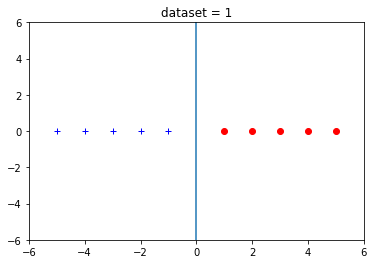


    Margin: 1.0
    support_vectors: [array([-1.,  0.,  1.]) array([ 1.,  0., -1.])]


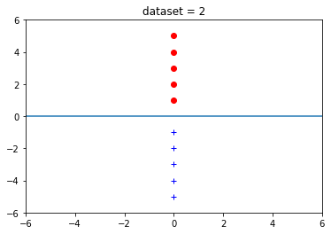


    Margin: 1.0
    support_vectors: [array([ 0., -1.,  1.]) array([ 0.,  1., -1.])]


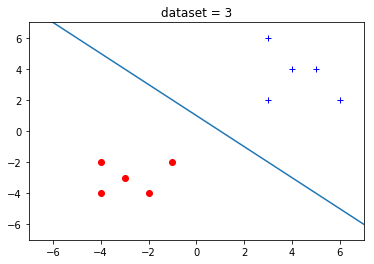


    Margin: 2.82842712475
    support_vectors: [array([-3., -3., -1.]) array([-4., -2., -1.]) array([ 4.,  4.,  1.])]


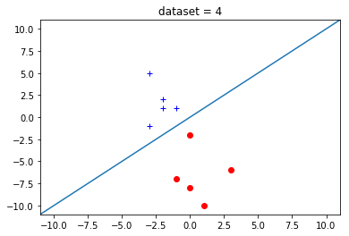


    Margin: 1.41421356237
    support_vectors: [array([-1.,  1.,  1.]) array([-3., -1.,  1.]) array([ 0., -2., -1.])]


## Part 2: Multi-class Classification Brute Force

### Report: 
#### Plot the training data, and the decision boundaries for each one-vs-rest problem on all multi-class datasets.

### 1st dataset decision boundaries


```python
data_m1, c1 = p.generate_training_data_multi(1)
W1, B1 = p.svm_train_multiclass(data_m1)
plot_hyperplane(W1,B1,data_m1,2)
```


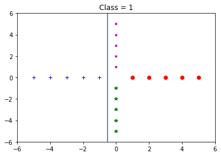


    w: [-3.  0.]
    b: -1.5


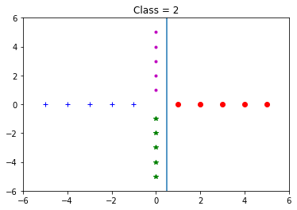


    w: [1.0, 0.0]
    b: -0.5


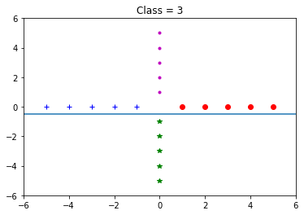


    w: [ 0. -3.]
    b: -1.5


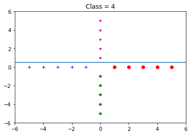


    w: [-0.0, -1.0]
    b: 0.5


### 2nd Dataset(multiclass)


```python
data_m2, c2 = p.generate_training_data_multi(2)
W2,B2 = p.svm_train_multiclass(data_m2)
plot_hyperplane(W2,B2,data_m2,2)
```


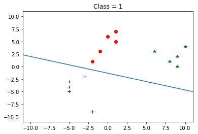


    w: [-1. -3.]
    b: -4.0


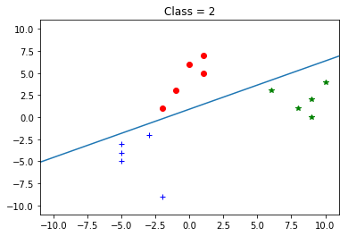


    w: [0.47885213068057331, -0.87789557291438436]
    b: 0.798086884468


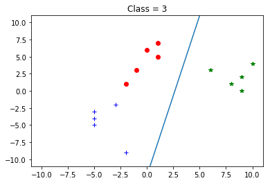


    w: [0.97780241407740942, -0.20952908873087345]
    b: -2.58419209435


## Problem 3: Kernel SVM

### Report: 
#### Plot the original data, along with the transformed data and the separator.
I will have to transform the data because the two classes are not linearly separable.


```python
data = p.generate_training_data_binary(5)
p.plt.title("Original Data")
p.plot_training_data_binary(data)

```


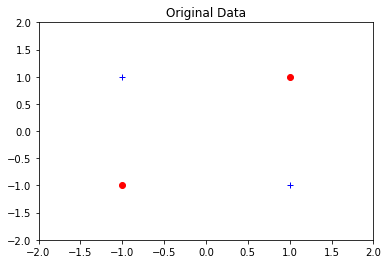


```python
data2 = p.np.array(p.np.copy(data))
data2[:,1] = data2[:,0]*data2[:,1]
w,b = p.kernel_svm_train(data)
p.plt.title("Transformed data")
plot_hyperplane([w],[b],data2,1)
```


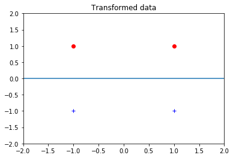


####  Is this the lowest-dimensional transformation of the data that has a linear separator? If so, explain why. If not, give a lower-dimensional transformation.

This is not the lowest dimensional transformation. One can transform the data into one dimension.
##### Transformation => [x1,x2] => [x1*x2]

Hyperplane/Separator will be:
if x1*x2 > 0 then label=-1 and if x1*x2 < 0 then label = 1
x1
